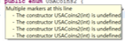

# 불연속 데이터  열거형 상수

### enum 열거형이름 { 상수명1\(값1\), 상수명2\(값2\) …              }

public enum USACoins { PENNY ,NICKLE ,DIME ,QUARTER } ==&gt;               public enum USACoins2 { PENNY\(1\) ,NICKLE\(5\) ,DIME\(10\) ,QUARTER\(25\) } 이렇게 만드게 되면 enum은 생성자를 찾지 못했으므로 error가 발생하게 된다. 

```java
package sample.enumtest;

public enum USACoins2 { 
	PENNY(1) ,NICKLE(5) ,DIME(10) ,QUARTER(25) }
```



1. 구성요소 

> parameter 를 갖는 private 적인 생성자  와  private 한 value  멤버변수가 필요하다


```java
package sample.enumtest;

public enum USACoins2 { 
	// 생성자를 호출하는 문장
	PENNY(1) ,NICKLE(5) ,DIME(10) ,QUARTER(25) ;
	// 1, 5, 10, 25 값을 기억하는 멤버변수
	private int value;
	private USACoins2(int value) {
		this.value=value;
	}
	public int getValue() {
		return value;
	}
	
}

```


사용예 

> parameter 를 갖는 private 적인 생성자  와  private 한 value  멤버변수가 필요하다


```java
package sample.enumtest;

public class DiscontinuityEnumUse {

	public static void method(USACoins2 coin) {
		System.out.println(coin+" : "+ coin.getValue()+"cents");
	}
	public static void main(String[] args) {
		method(USACoins2.QUARTER);
		
	// 매핑된 값 출력
		for(USACoins2 value : USACoins2.values()){
		   method(value );
		}
	}
}
////////////////////////////
QUARTER : 25cents
PENNY : 1cents
NICKLE : 5cents
DIME : 10cents
QUARTER : 25cents
```


> 위 예제  USACoins2  는 다음  Currency 클래스와과 같은 뜻으로 이해하면 된다.

```java
package sample.enumtest;

public final class Currency {
	// Currency.PENNY
	public static final  Currency PENNY;
	public static final  Currency QUARTER;
	static {
		PENNY=new Currency("PENNY", 1);
		QUARTER=new Currency("QUARTER", 25);
	}
	public final String name;
	public final int value;

	static public Currency[] values() {
		return new Currency[] {PENNY,QUARTER};
	}
	static public int valueOf(String name) {
		Currency[] cs= values();
		for( Currency  c : cs  ) {
			if(c.name.equals(name)) {
				return c.value;
			}
		}
		return 0;
	}
	
	public static int valueOf(Currency c) {
		// TODO Auto-generated method stub
		return valueOf(c.name);
	}
	
	private Currency(String name, int value) {
		this.name = name;
		this.value = value;
	}
	@Override
	public String toString() {
		return name ;
	}
	
	
}
////////////////////////////////////
package sample.enumtest;

public class CurrencyUse {

	public static void main(String[] args) {
		// TODO Auto-generated method stub
		Currency currency = Currency.PENNY;
		
		System.out.println(currency+" : "+ Currency.PENNY.value);
		
		for(Currency c  : Currency.values() ) {
			System.out.println(c +" : "+ Currency.valueOf(c) );
		}
	}
}

```

> 위 enum 스러운 예제를 약간 정리한것은 다음과 같은 실행은 CurruncyUse를 사용하면 된다.

```java
package sample.enumtest;

public final class Currency {
	// Currency.PENNY
	public static final  Currency PENNY;
	public static final  Currency QUARTER;
	public static final Currency ENUMS$values[];
	
	static {
		PENNY=new Currency("PENNY", 1);
		QUARTER=new Currency("QUARTER", 25);
		ENUMS$values=( new Currency[] {PENNY,QUARTER});
	}

	static public Currency[] values() {
		Currency temp[];
		int i ;
		Currency temp2[];
		System.arraycopy(temp=ENUMS$values, 0,
				temp2=new Currency[i=temp.length], 0, i);
		return temp2;
	}
	
	static public int valueOf(String name) {
		Currency[] cs= values();
		for( Currency  c : cs  ) {
			if(c.name.equals(name)) {
				return c.value;
			}
		}
		return 0; // 해당하는 이름이 없을 때 일단 0을 리턴하지만 ,
		          // 예외를 발생하거나 error를 발생하는 것도 좋겠 
	}
	
	public static int valueOf(Currency c) {
		return valueOf(c.name);
	}
	
	public final String name;
	public final int value;
	
	private Currency(String name, int value) {
		this.name = name;
		this.value = value;
	}
	@Override
	public String toString() {
		return name ;
	}
}

```

 추상메소드 정의한 구현부 제공     

> PENNY는 1센트이고 구리를 리턴하도록 만들려면  생성자를 호출하는 문장에서 추상메소드를 구현한다.


```java
package sample.enumtest;

public enum USACoins3 {
	// 생성자를 호출하는 문장
	PENNY(1) {
		@Override
		public String color() {
			return "구리";
		}
	},
	NICKLE(5) {
		@Override
		public String color() {
			return "청동";
		}
	},
	DIME(10) {
		@Override
		public String color() {
			return "실버";
		}
	},
	QUARTER(25) {
		@Override
		public String color() {
			return "실버";
		}
	};

	// 1, 5, 10, 25 값을 기억하는 멤버변수
	private int value;

	private USACoins3(int value) {
		this.value = value;
	}

	public int getValue() {
		return value;
	}

	public abstract String color();
}

```


 사용 예 


```java
package sample.enumtest;

public class DiscontinuityEnumUse2 {

	public static void method(USACoins3 coin) {
		System.out.println(
				coin+" : "+ coin.getValue()+"cents" + coin.color());
	}
	public static void main(String[] args) {
		method(USACoins3.QUARTER);
		
	// 매핑된 값 출력
		for(USACoins3 value : USACoins3.values()){
		   method(value );
		}
	}
}
//////////
QUARTER : 25cents실버
PENNY : 1cents구리
NICKLE : 5cents청동
DIME : 10cents실버
QUARTER : 25cents실버
```


일반 클래스와 마찬가지로  interface 로 확장할 수 있다.


```java
package sample.enumtest;

public enum USACoins4  implements Runnable{ 
	// 생성자를 호출하는 문장
	PENNY(1) ,NICKLE(5) ,DIME(10) ,QUARTER(25) ;
	// 1, 5, 10, 25 값을 기억하는 멤버변수
	private int value;
	private USACoins4(int value) {
		this.value=value;
	}
	public int getValue() {
		return value;
	}
	@Override
	public void run() {
		// TODO Auto-generated method stub
		System.out.println(" USACoins4 value : "+value);
	}
}
```


사용 예 


```java
package sample.enumtest;

public class DiscontinuityEnumUse3 {

	public static void main(String[] args) {
	// 매핑된 값 출력
		for(USACoins4 value : USACoins4.values()){
			Thread th = new Thread(value);
			th.start();
		}
	}
}
/////////////////////////
 USACoins4 value : 1
 USACoins4 value : 10
 USACoins4 value : 25
 USACoins4 value : 5
```


