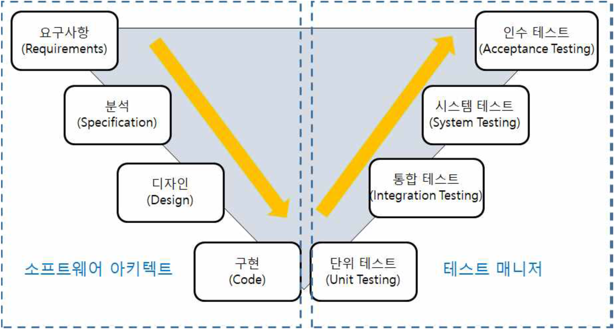
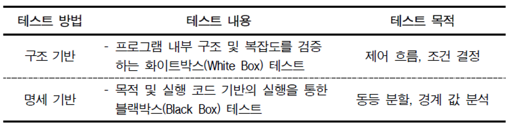
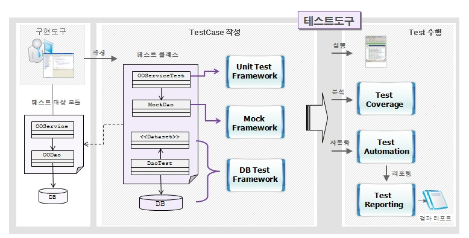

# Unit Test 단위테스트

## 단위테스트\(Unit Test\)?

### [단위테스트\(Unit Test\)](https://ko.wikipedia.org/wiki/%EC%9C%A0%EB%8B%9B_%ED%85%8C%EC%8A%A4%ED%8A%B8) :  컴퓨터 프로그래밍에서 소스코드의 특정 모듈이 의도된 대로 정확히 작동하는지 검증는 절차.  모든 함수와 메소드에 대한 테스트 케이스\(Test Case\)를 작성하는 절차를 말한다. 

> * 작은 소프트웨어 단위\(컴포넌트 또는 모듈\)를 테스트하는 것으로서, 일반적으로 개발자 자신에 의해 행해진다. 과거에는 시간 부족을 이유로 단위 테스트가 생략되었으나 최 근에는 개발 도구의 발전으로 개발 과정 중에 자동으로 진행된다. 단위 테스트는 아주 중요한 부분이므로 개발 도구에서 지원하지 않아도 반드시 수행해야 한다.

## 단위 테스트  방법 및 목적 


### 테스트 가능한 단위로 작게 분리된 소프트웨어 내에서 결함을 찾고 기능을 검증하는 테스트 활동이다.

* **구조 기반은 업무 단위별 제어 흐름과 조건 결정에 따른 결과를 테스트하는 데 목적이 있다**
* **명세 기반은 동등 분할과 경계 값 분석을 위하여 사용자의 입력, 출력, 내부, 이벤트 등을 확인하는 데 목적이 있다.**


 참고 사이트 :  NCS 사이 애플리케이션테스트수행에서 학습모듈 [htps://www.ncs.go.kr/unity/hmn01/hmn0101/ncsResultSearch.do?dutySvcNo=SVC201700146&ncsClCd=2001020227\_16v4&ncsLclasCd=20&ncsMclasCd=01&ncsSclasCd=02&ncsSubdCd=02&ncsCompeUnitCd=27&doCompeUnit=true&output=ncsRsnInfo](https://www.ncs.go.kr/unity/hmn01/hmn0101/ncsResultSearch.do?dutySvcNo=SVC201700146&ncsClCd=2001020227_16v4&ncsLclasCd=20&ncsMclasCd=01&ncsSclasCd=02&ncsSubdCd=02&ncsCompeUnitCd=27&doCompeUnit=true&output=ncsRsnInfo) 

> ##  egovframework:dev3.7:tst:unit\_test \[eGovFrame\]
>
> ### Unit Test란 대상 코드에 대해 테스트하고자 개발자가 작성한 코드로서, 주로 특정 메소드를 실행해서 그 결과가 기대값과 일치하는지 확인하는 형태이며, Unit Test는 서로 독립적으로 수행되어야 한다.
>
> * 효과
>   *  작성한 코드의 설계 개선 작업 시, 코드 품질에 대한 확신
>   *  코드 수정 시 버그를 쉽게 찾을 수 있게 해줌
>   *  자동화된 회귀 테스트 \(Regression Test\)를 가능하게 해주는 Source가 됨
> *  작성범위
>   *  주요 흐름에 대한 테스트 \(the happy path\)
>   * 또 다른 주요 흐름에 대한 테스트 \(the main alternative path\)
>   * 경계 조건에 대한 테스트 \(null 인자 체크 등\)
>   * Exception 테스트 \(Exception 발생하는 조건에 대한 테스트\)

 egovframework:dev3.7:tst:unit\_test \[eGovFrame\]

**TestCase 작성**

*  개발자가 구현도구를 통해 코드를 작성할 때, 그 코드를 대상으로 하는 TestCase를 작성할 수 있다. 예를 들어, OOService 클래스의 TestCase인 OOServiceTest를 작성할 수 있는 기반 Framework인 Unit Test Framework을 제공한다. - [Test Case](https://www.egovframe.go.kr/wiki/doku.php?id=egovframework:dev2:tst:test_case)
* 개발자가 테스트하고자하는 OOService와 관련있는 OODao에 대해서, MockDao를 작성할 수 있는 라이브러리를 제공한다. 혹은, 이미 구현된 기능을 제공하는 Mock 객체도 제공한다. - [Mock Support](https://www.egovframe.go.kr/wiki/doku.php?id=egovframework:dev2:tst:mock_support)
*  Dao와 DB에 걸쳐진 Persistence Layer를 테스트할 수 있는 DB Test Framework을 제공하여 DB 연결, 데이터 초기화, 트랜잭션 처리 등 DB Test를 위한 TestCase 작성을 지원한다. - [DB Support](https://www.egovframe.go.kr/wiki/doku.php?id=egovframework:dev2:tst:db_support)

**Test 수행**

*  작성한 TestCase를 수행하여 성공/실패 여부를 알려준다.
* TestCase가 작성된 범위를 수치나 코드 라인으로 알려줌으로써 TestCase가 테스트하지 못한 영역을 알려준다. - [Test Coverage](https://www.egovframe.go.kr/wiki/doku.php?id=egovframework:dev2:tst:test_coverage)
* 작성된 TestCase를 자동화하여 수시로 테스트할 수 있도록 한다. - [Test Automation](https://www.egovframe.go.kr/wiki/doku.php?id=egovframework:dev2:tst:test_automation)

**Test Reporting**

*  Coverage 분석 : 테스트 대상 모듈에 대해 테스트 클래스가 테스트를 수행하는 그 범위를 수치를 분석하여, 테스트 수행 범위를 보여줌 - [Test Coverage](https://www.egovframe.go.kr/wiki/doku.php?id=egovframework:dev2:tst:test_coverage)
*  Test Reporting : 테스트를 수행한 결과를 Text, Html, XML, Excel 등의 보고서 형태로 작성함 - [Test Reporting](https://www.egovframe.go.kr/wiki/doku.php?id=egovframework:dev2:tst:test_reporting)

**Unit Test open source - eGovframework에서 사용하고 있는 것 중심**

| **이름** | **설 명**   |
| :---: | :--- |
|  [JUnit](http://junit.org/) | 단위 테스트 클래스 작성과 실행을 위한 기본적인 기능을 제공  |
|  [EasyMock](http://www.easymock.org/) | 단위 테스트 클래스 작성 시 Mocking 을 위해 사용 |
|  [DbUnit](http://dbunit.sourceforge.net/) | 데이터베이스 관련 Test Fixture 자동 생성 등의 DB Support 를 위해 사용 |
|  [EMMA](http://emma.sourceforge.net/) | Test Coverage 분석 |
|  [Spring Test](http://www.springsource.org/) | Springframework 의 Test 관련 기능 활용 |
|  [Unitils](http://unitils.sourceforge.net/) | JUnit, EasyMock, DbUnit, Spring Test, Ibatis, Hibernate 등을 유연한 구조로 엮어서 테스트할 수 있는 기반 구조 및 유틸을 제공 |
|  [Ant](http://ant.apache.org/) | Java-based build tool |
|  [Maven](http://unitils.sourceforge.net/summary.html) | 프로젝트 관리 도구 |
|  [EclEmma](http://www.eclemma.org/) | EMMA Eclipse Plug-in |
|  |  |

