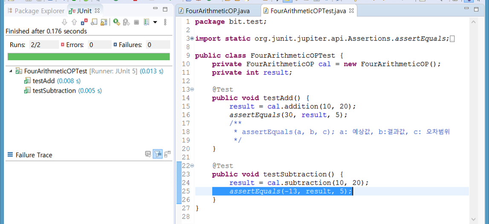

# JUnit

> ## JUnit : 자바용 단위 테스트 작성을 위한 표준 프레임워크


[ egovframework:dev3.7:tst:unit\_test \[eGovFrame\]](https://www.egovframe.go.kr/wiki/doku.php?id=egovframework:dev3.7:tst:unit_test)


```java
package bit.unit;

public class FourArithmeticOP {

	public int addition(int num1, int num2) {
		return num1 + num2;
	}

	public int subtraction(int num1, int num2) {
		return num1 - num2;
	}

	public int multiplication(int num1, int num2) {
		return num1 * num2;
	}

	public int division(int num1, int num2) {
		return num1 / num2;
	}
}
```



```java
package bit.test;

import static org.junit.jupiter.api.Assertions.assertEquals;

import org.junit.Test;

import bit.unit.FourArithmeticOP;

public class FourArithmeticOPTest {
	private FourArithmeticOP cal = new FourArithmeticOP();
	private int result;

	@Test
	public void testAdd() {
		result = cal.addition(10, 20);
		assertEquals(30, result, 5);
		/**
		 * assertEquals(a, b, c); a: 예상값, b:결과값, c: 오차범위
		 */
	}

	@Test
	public void testSubtraction() {
		result = cal.subtraction(10, 20);
		assertEquals(30, result, 5);
	}
}

```





>

