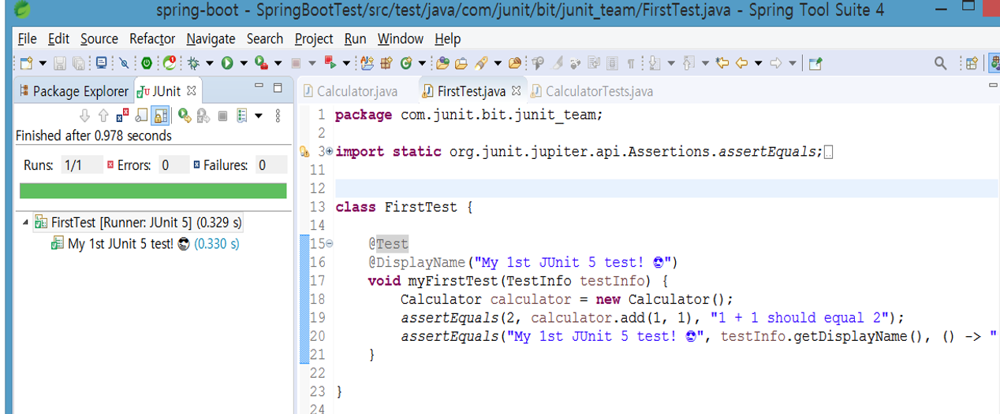
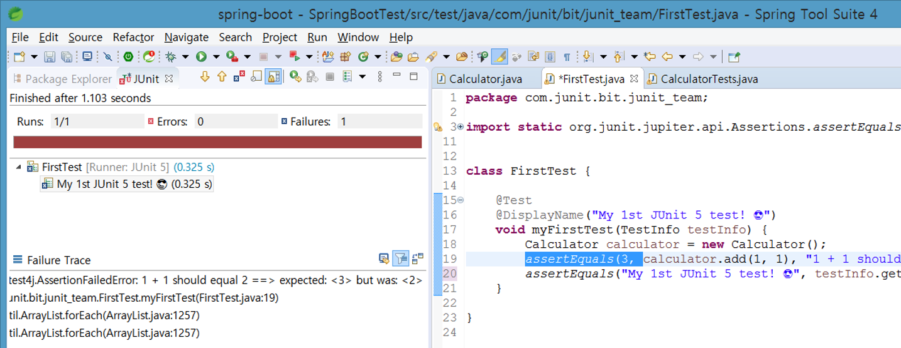

# JUNIT\_Team examples

## Source Github :

> ### [https://github.com/junit-team/junit5/tree/master/documentation](https://github.com/junit-team/junit5/tree/master/documentation)
>
> ### [https://github.com/junit-team/junit5-samples](https://github.com/junit-team/junit5-samples)

### 

### Calculator.java


```java
package com.junit.bit.junit_team;
public class Calculator {

	public int add(int a, int b) {
		return a + b;
	}
	public int sub(int num1, int num2) {
		return num1 - num2;
	}

	public int multi(int num1, int num2) {
		return num1 * num2;
	}

	public int div(int num1, int num2) {
		return num1 / num2;
	}
}
```


## Unit case  class

## 1. FirstTest.java


```java
package com.junit.bit.junit_team;

import static org.junit.jupiter.api.Assertions.assertEquals;

import org.junit.jupiter.api.DisplayName;

import org.junit.jupiter.api.Test;
import org.junit.jupiter.api.TestInfo;

import com.junit.bit.junit_team.Calculator;


class FirstTest {

	@Test
	@DisplayName("My 1st JUnit 5 test! 😎")
	void myFirstTest(TestInfo testInfo) {
		Calculator calculator = new Calculator();
		assertEquals(2, calculator.add(1, 1), "1 + 1 should equal 2");
		assertEquals("My 1st JUnit 5 test! 😎", testInfo.getDisplayName(), () -> "TestInfo is injected correctly");
	}

}

```


### 예측한 결과가 맞을 때 결과 



### 예측결과가 계산결과와 다를 때  화



## 2. SecondTest.java

```java
package com.junit.bit.junit_team;

import static org.junit.jupiter.api.Assertions.assertEquals;

import org.junit.jupiter.api.Disabled;
import org.junit.jupiter.api.Tag;
import org.junit.jupiter.api.Test;

class SecondTest {

	@Test
	@Disabled
	void mySecondTest() {
		assertEquals(2, 1, "2 is not equal to 1");
	}

	@Test
	@Tag("slow")
	void aSlowTest() throws InterruptedException {
		Thread.sleep(1000);

	}
}
```

## 3. JUnit4Test.java

```java
package com.junit.bit.junit_team;
import static org.junit.Assert.assertEquals;

import org.junit.Test;

public class JUnit4Test {

	@Test
	public void test() {
		assertEquals(3, 1 + 2);
	}
}

```

## CalculatorTests.java

```java
package com.junit.bit.junit_team;
import static org.junit.jupiter.api.Assertions.assertEquals;

import org.junit.jupiter.api.DisplayName;
import org.junit.jupiter.api.Test;
import org.junit.jupiter.params.ParameterizedTest;
import org.junit.jupiter.params.provider.CsvSource;

import com.junit.bit.junit_team.Calculator;

class CalculatorTests {

	@Test
	@DisplayName("1 + 1 = 2")
	void addsTwoNumbers() {
		Calculator calculator = new Calculator();
		assertEquals(2, calculator.add(1, 1), "1 + 1 should equal 2");
	}

	@ParameterizedTest(name = "{0} + {1} = {2}")
	@CsvSource({
			"0,    1,   1",
			"1,    2,   3",
			"49,  51, 100",
			"1,  100, 101"
	})
	void add(int first, int second, int expectedResult) {
		Calculator calculator = new Calculator();
		assertEquals(expectedResult, calculator.add(first, second),
				() -> first + " + " + second + " should equal " + expectedResult);
	}
}


```

