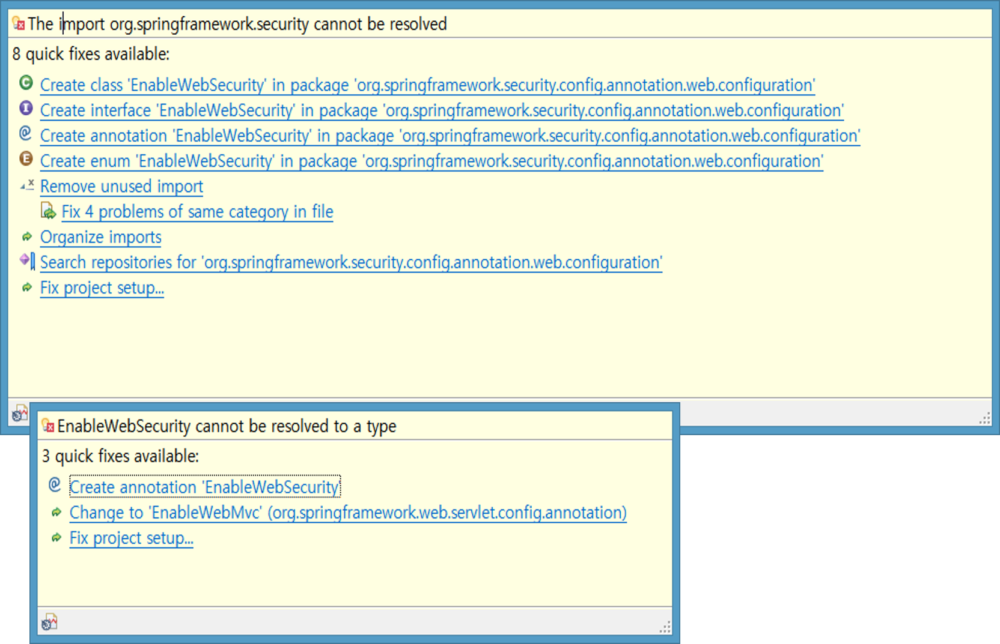

# errors

## @EnableWebSecurity 스프링 시큐리티 어노테이션 추가시 에러가 난다면 다음을 확인해봅니다.




###  @EnableWebSecurity  cannot be resolved to a type spring boot

### The import org.springframework.security cannot be resolved

* pom.xml에 dependencies 부분에 추가되어 있는지  확인합니다 없으면 추가시켜주면 해결


```markup
		<dependency>
			<groupId>org.springframework.boot</groupId>
			<artifactId>spring-boot-starter-security</artifactId>
		</dependency>
```


* 다음 처럼 scope이 test로 잡혀있다면 지우면 된다  


```markup
	<dependency>
			<groupId>org.springframework.boot</groupId>
			<artifactId>spring-boot-starter-security</artifactId>
			<scope>test</scope>
		</dependency>

```


