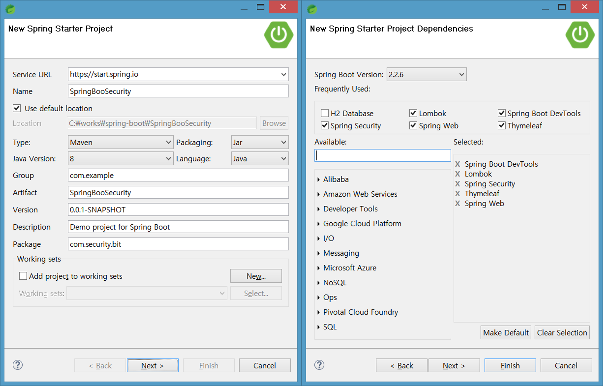
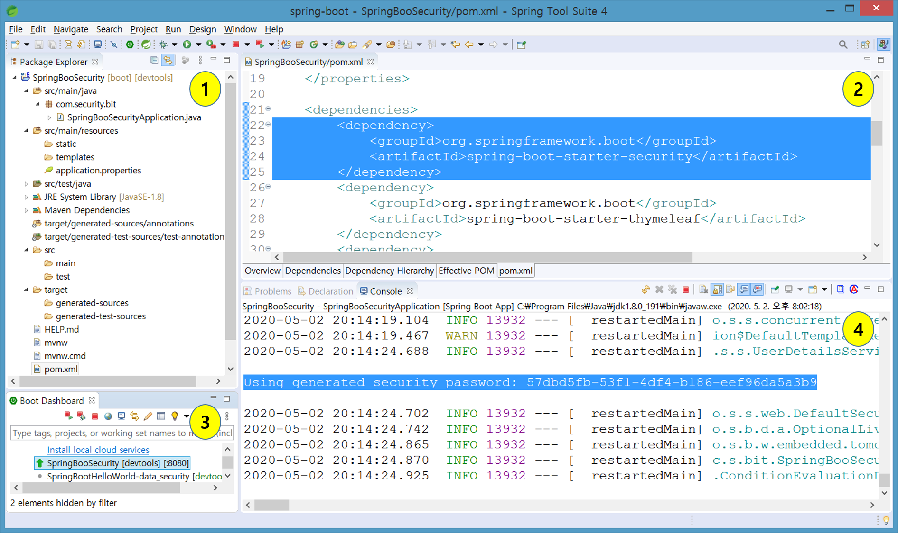
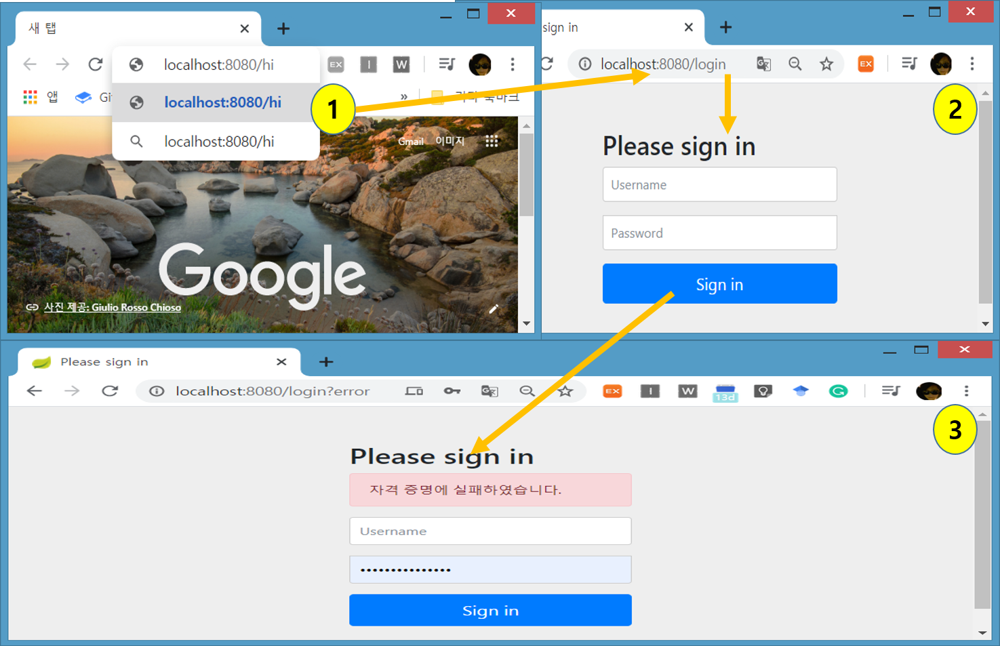

# First Spring Boot Security

## Spring이 지원이하는 Security : 환경설정 추가없이 Login 화면 실행

* 신규 프로젝트 생성- SpringBooSecurity

* 1번 : package와 Controller를는 만들지 않았다.  
* 2번 : Security dependency 설정
* 3번 : 서버실행 후
* 4번 :  Using generated security password: 57dbd5fb-53f1-4df4-b186-eef96da5a3b9 부분이 출력된다.

* 1번 :  [http://localhost:8080/아무거나입력](http://localhost:8080/아무거나입력) 
* 2번 :  [http://localhost:8080/login](http://localhost:8080/login)  화면으로 자동이동된다 
* 3번 :  사용자명과 암호를 아무거나 입력하고 sign in을 누르면 login fail 화면으로 이동한다.

## 

