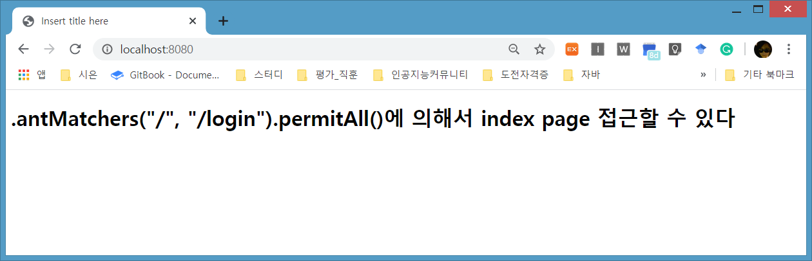

# Simple Custom Login Page\#2

## Login 화면 환경설정 추가 Custom LoginPage 실행

### SpringBooSecurity3

 SpringBooSecurity2를 복사해서 사용한다

### 파일수정  

* _**SecurityConfig.java**_ 
* * configure\(HttpSecurity http\) 내용 변경


```java
package com.security.bit.config;

import org.springframework.context.annotation.Configuration;
import org.springframework.security.config.annotation.web.builders.HttpSecurity;
import org.springframework.security.config.annotation.web.configuration.EnableWebSecurity;
import org.springframework.security.config.annotation.web.configuration.WebSecurityConfigurerAdapter;
@Configuration
@EnableWebSecurity
class SecurityConfig extends WebSecurityConfigurerAdapter {
	@Override
	protected void configure(HttpSecurity http) throws Exception {
		// "/","login"을 제외한 모든 요청에 대해 인증이 되어야한다 . 
		// 인증정보를 받기위한 로그인페이지를 지정해서 사용하겠다 
		http
			.authorizeRequests()
				.antMatchers("/","/login").permitAll()
				.anyRequest().authenticated()
		  .and() 
		  	  .formLogin() 
		  	  	.loginPage("/login")
		  	  	.permitAll();// login을 위해 모든 사용자들에게 접속허용
 	}
}

```


> * .antMatchers\("/","/login"\).permitAll\(\) : 모든사용자가 "/", "login"으로 접근할 수 있다. 인증이 필요없는 URL 패턴l을 지정한준다
>
>   > * antMatchers\("/admin/\*\*"\).haseRole\("ADMIN"\) : "/admin/"으로 시작하는 권한이 ADMIN 인 사용자에게 제한 된다.

* _**index.html**_ 

  내용을 다음과 같이 변경후 실행해 보


```markup
<!DOCTYPE html>
<html xmlns:th="http://www.thymeleaf.org">
<head>
<meta charset="UTF-8">
<title>Insert title here</title>
</head>
<body>
	  <h1> .antMatchers("/", "/login").permitAll()에 의해서 index page 접근할 수 있다</h1>
</body>
</html>
```


### 실행

* [http://localhost:8080/](http://localhost:8080/)  






