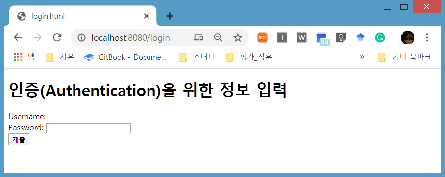

# Simple Custom Login Page\#1

## Login 화면 환경설정 추가 Custom LoginPage 실행

### 신규 프로젝트 생성- SpringBooSecurity2


### security dependency 설정


```markup
<dependency>
			<groupId>org.springframework.boot</groupId>
			<artifactId>spring-boot-starter-security</artifactId>
</dependency>
```


### 파일생성  

* _**SecurityConfig.java**_ 

  WebSecurityConfigurerAdapter를 상속받는  스프링 스큐리티 자바파일을 만든다. 

*         springSecurityFilterChain 클래스가 자동으로 포함된다.
          springSecurityFilterChain 클래스가 자동으로 포함된다.

*          환경설정 어노테이션, Single Tone Bean으로 한번만 생성
           환경설정 어노테이션, Single Tone Bean으로 한번만 생성

*         custom 인증 매커니즘을 구성하기위해 override한다
          custom 인증 매커니즘을 구성하기위해 override한다


```java
package com.security.bit.config;

import org.springframework.context.annotation.Configuration;
import org.springframework.security.config.annotation.web.builders.HttpSecurity;
import org.springframework.security.config.annotation.web.configuration.EnableWebSecurity;
import org.springframework.security.config.annotation.web.configuration.WebSecurityConfigurerAdapter;
@Configuration
@EnableWebSecurity
class SecurityConfig extends WebSecurityConfigurerAdapter {
	@Override
	protected void configure(HttpSecurity http) throws Exception {
		// 모든 요청에 대해 인증이 되어야한다 . 인증정보를 받기위한 로그인페이지를 지정해서 사용하겠다 
		http.authorizeRequests()
			.anyRequest().authenticated()
		  .and() 
		  	  .formLogin() 
		  	  	.loginPage("/login")
		  	  	.permitAll();// login을 위해 모든 사용자들에게 접속허용
 	}
}

```


> * .authorizeRequests\(\) : 요청에 대한 권한을 지정한다.
> * .anyRequest\(\).authenticated\(\) :  모든요구에 대해 인증이 되어야 한다
> * .formLogin\(\).loginPage\("/login"\).permmitAll\(\) :  인증정보를 받기 위한 로그인 페이지를 지정하고, 그 로그인 페이지에는 모든 사용자가 접속할 수 있다.

* _**WebStartController**_ 


```java
package com.security.bit.controller;

import org.springframework.stereotype.Controller;
import org.springframework.ui.Model;
import org.springframework.web.bind.annotation.RequestMapping;

@Controller
public class WebStartController {
	@RequestMapping("/")
	public String index() {
		return "index";
	}
	@RequestMapping("/login")
	public String login() {
		return "login";
	}
}

```


* _**login.html**_ 

  [http://localhost:8080](http://localhost:8080/)/아무거나  입력하면 호출될 페이지

  인증을 위한 정보를 입력받을 페이지


```markup
<!DOCTYPE html>
<html xmlns:th="http://www.thymeleaf.org">
<head>
<meta charset="UTF-8">
<title>login.html</title>
</head>
<body>
	<h1>인증(Authentication)을 위한 정보 입력</h1>
	<form action="" method="post">
		<label>Username:</label> <input type="text" name="username" /><br>
		<label>Password:</label> <input type="text" name="password" /><br>
		<input type="submit"/>
	</form>
</body>
</html>
```


* _**index.html**_ 

  [http://localhost:8080/](http://localhost:8080/) 로 호출될 페이지

  하지만, index.html이 나타나지 않고 login.html이 출력된다. 

  SecurityConfig  에서 .anyRequest\(\).authenticated\(\) 로 설정되어 있기때문이다.


```markup
<!DOCTYPE html>
<html xmlns:th="http://www.thymeleaf.org">
<head>
<meta charset="UTF-8">
<title>Insert title here</title>
</head>
<body>
	 <h1>index page 접근할 수 없다</h1>
	
  <p> 접근을 시도하면 login 페이지가 출력된다</p>
</body>
</html>
```


### 실행

* [http://localhost:8080/](http://localhost:8080/)  
* [http://localhost:8080](http://localhost:8080/)/아무거나 입력 




### 예제파일




