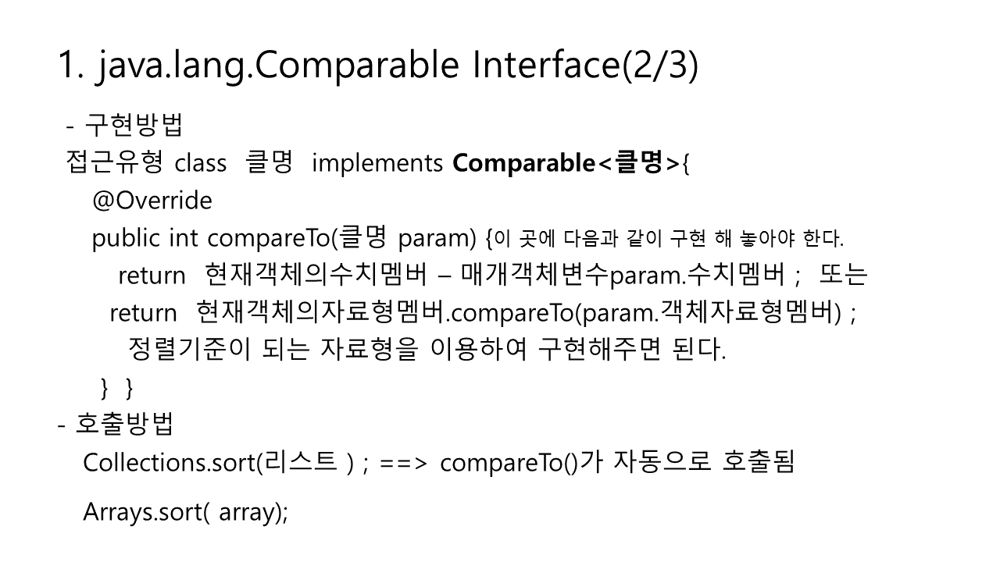
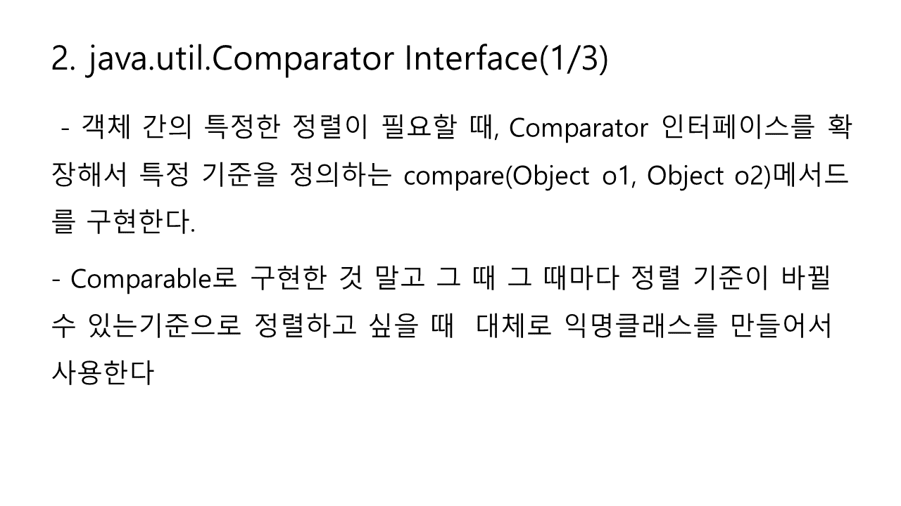

# Comparable vs Comparator

## java.lang.Comparable Interface

> ####  - **정렬 수행 시 기본적으로 호출되고 정렬 기준이 되는  compareTo\(\) 메서드를 선언한 인터페이스**
>
> ####  - JDK에서 제공되는 정렬이 가능한 클래스들은 모두 Comparable 인터페이스의 compareTo\(\) 를 구현하고 있으며, 정렬 시에 이에 맞게 정렬이 수행된다.
>
> ####  - 수치타입 : 오름차순 정렬
>
> ####  - String  : 사전순 정렬


###  구현방법

####  접근유형 class  클명  implements Comparable&lt;클명&gt;{

    **@Override**

    **public int compareTo\(클명 param\) {**

        **이 곳에 다음과 같이 구현 해 놓아야 한다.**

       **return  현재객체의수치멤버 – 매개객체변수param.수치멤버 ;          또는**

       **return  현재객체의자료형멤버.compareTo\(param.객체자료형멤버\) ;**

        **정렬기준이 되는 자료형을 이용하여 구현해주면 된다.**

     **}**  

**}**   



### 호출방법

#### Collections.sort\(리스트 \) ; ==&gt; compareTo\(\)가 자동으로 호출됨   

####  Arrays.sort\( array\);


#### x값은 오름차순, x값이 같으면 y값 내람차순으로 정렬

### java.util.Comparator Interface

## java.util.Comparator Interface  

